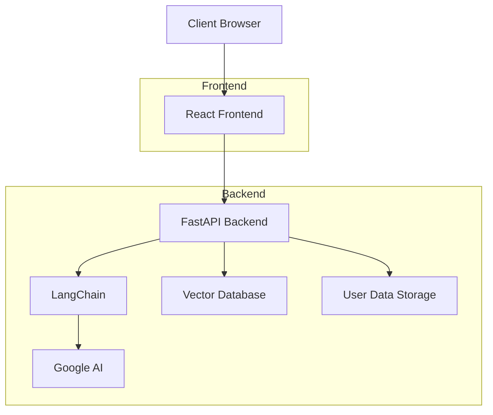
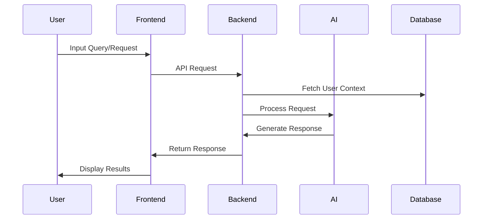

# 🧠 FLEX AI Life Coach Web App

<div align="center">
  
</div>

## 📝 Overview

FLEX AI Life Coach is an innovative web application that leverages artificial intelligence to provide personalized life coaching and guidance. This project represents our first graduation project, combining cutting-edge technologies to create an intelligent and user-friendly life coaching platform.

## 🎯 Project Goals

- Provide personalized life coaching through AI-powered interactions
- Create an intuitive and engaging user interface
- Implement secure and efficient data handling
- Deliver actionable insights and recommendations
- Support continuous learning and improvement

## 🛠️ Technologies Used

<div align="center">

### Frontend


### Backend


</div>

## ✨ Features

### Rich Text Support
- Full Markdown rendering in chat messages
- Syntax highlighting for code blocks
- Support for tables, lists, and blockquotes
- Inline code formatting
- Secure HTML sanitization
- Responsive design for all screen sizes

### Chat Interface
- Real-time message updates
- Typing indicators
- Message animations
- Code block syntax highlighting
- Markdown formatting
- Link previews
- File attachments

### AI Integration
- Natural language processing
- Context-aware responses
- Personalized recommendations
- Goal tracking and progress monitoring
- Adaptive learning

## 📈 Data Analysis

As part of developing the **FLEX AI Life Coach**, we conducted a detailed **data analysis process** to deeply understand the target users, their productivity patterns, and the factors that truly impact their daily performance.

> **This analysis was not just an extra step—it was a core part of the project.**  
> Every feature we added was based on real, measurable data—not assumptions.

The goal was to ensure that the FLEX AI system provides truly **impactful, personalized coaching based on actual user behaviors and trends.**

---

### 🔄 Workflow Overview

We followed a structured data analysis process that included:

1. **Data Collection:** Gathering data from user interactions and activities.
2. **Data Understanding:** Cleaning and preparing the data to ensure accuracy.
3. **Define Key Questions:** Identifying the critical questions about productivity and user behavior.
4. **Data Analysis:** Using statistical methods to uncover trends and influencing factors.
5. **Dashboard Creation:** Building interactive Power BI dashboards to visualize the findings.
6. **Insights Extraction:** Drawing actionable insights that guided our design decisions and feature development.

<div align="center">
  
</div>

---

### 📊 Dashboard Insights

We created interactive dashboards using **Power BI** to visualize the key findings.

#### 📌 Dashboard Example 1:
<div align="center">
  
</div>

#### 📌 Dashboard Example 2:
<div align="center">
  
</div>

---

### 🚀 Key Takeaways

- The majority of users are students who struggle with consistency in habits.
- **Focus level** and **daily planning** significantly impact productivity.
- **Sleep duration** has a direct correlation with performance.
- Users who consistently track their progress achieve higher task completion rates.
- Time management tools are widely used by high-performing users.

---
  
## 📊 Architecture



## 🔄 Workflow



## 🚀 Installation

### Prerequisites
- Node.js (v18 or higher)
- Python (v3.8 or higher)
- npm or yarn
- Git

### Frontend Setup
1. Clone the repository:
   ```bash
   git clone [repository-url]
   cd flex-ai-life-coach
   ```

2. Install dependencies:
   ```bash
   npm install
   # or
   yarn install
   ```

3. Start the development server:
   ```bash
   npm run dev
   # or
   yarn dev
   ```

### Backend Setup
1. Create a virtual environment:
   ```bash
   python -m venv venv
   source venv/bin/activate  # On Windows: venv\Scripts\activate
   ```

2. Install Python dependencies:
   ```bash
   pip install -r requirements.txt
   ```

3. Set up environment variables:
   Create a `.env` file in the root directory with:
   ```
   GOOGLE_API_KEY=your_api_key
   DATABASE_URL=your_database_url
   ```

4. Start the backend server:
   ```bash
   uvicorn main:app --reload
   ```

## 📦 Dependencies

### Frontend Dependencies
- React 18
- TypeScript
- TailwindCSS
- Radix UI Components
- React Router DOM
- React Query
- Framer Motion
- React Markdown
- React Syntax Highlighter
- Rehype Raw & Sanitize
- And more (see package.json)

### Backend Dependencies
- FastAPI
- LangChain
- Google Generative AI
- FAISS
- scikit-learn
- numpy
- And more (see requirements.txt)

## 🏗️ Project Structure

```
flex-ai-life-coach/
├── assets/              # Static assets and images
├── src/                 # Frontend source code
│   ├── components/     # React components
│   ├── pages/         # Page components
│   ├── services/      # API services
│   └── utils/         # Utility functions
├── backend/            # Backend source code
│   ├── api/           # API endpoints
│   ├── models/        # Data models
│   └── services/      # Business logic
├── vector_db/         # Vector database storage
└── public/            # Public assets
```

## 👥 Team

- Mohamed Wael
- Mohamed Amr
- Kareem Nagah
- Amr Amgad
- Youssef Alsebaey
- Loay Ayman
- Abdallah Elhosseny
- Salma Gamal
- Tasneem Osama

## 🙏 Acknowledgments

- Our mentors and professors
- The open-source community
- All contributors who have helped shape this project


---

<div align="center">
  
  <br/>
  <em>Empowering lives through AI-driven coaching</em>
</div>
